### 仿生爬壁机器人综述

读了一篇比较新的综述类文章

[爬壁机器人发展与关键技术综述](./reference/爬壁机器人发展与关键技术综述.pdf)

**文章主要内容**

文章综述了爬壁机器人的研究现状、关键技术及发展趋势，主要从**吸附方式**、**行走方式**、**驱动方式**和**壁面过渡**等方面进行了归纳。分析表明爬壁机器人在吸附性和机动性之间存在矛盾，壁面过渡能力仍有局限性，距离实际应用存在差距。

**吸附方式**上, 有**负压吸附**, **磁吸附**, **仿生吸附**, **静电吸附**, **粘结剂吸附**. 从资源受限和节省成本等方面考虑, 我们基本上只能用**负压吸附**和**电磁吸附**.

**行走方式**上, 有**多足式**, **轮式**, **框架式**, **履带式**, **混合式**. 考虑仿生壁虎的话, 只能做**多足式**, 但是多足式各关节运动自由度不少, 建模与控制估计难度都不小. 关键点在于多个关节电机, 吸附电机要怎么集成在20cm左右的小机器人上. 

**驱动方式**上, 有**气压驱动**, **液压驱动**, **电机驱动**. **吸附电机**上, 小机器人用**气压驱动**就可以, **运动电机**需要根据具体的行走方式来决定采用**舵机**, **步进电机**还是**编码电机**.

---

### 可参考平行项目分析

**钩爪爬壁吸附机器人**

文章在这里

[仿生爬壁机器人设计与实现](./reference/仿生爬壁机器人设计与实现.pdf)

这篇硕士论文描述了一个**完整仿生爬壁机器人样机的设计与实现**, 包括**电路**, **结构**, 部分**软件**框图, 对我们的机器人设计非常有参考价值

这是它的结构和电路, 在文章里面有更加详细的描述, 预备做结构和电路的可以先去看看

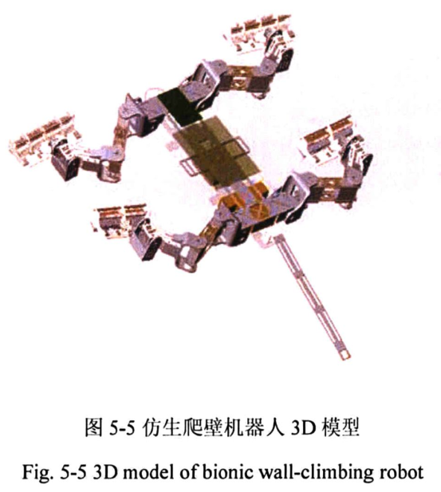
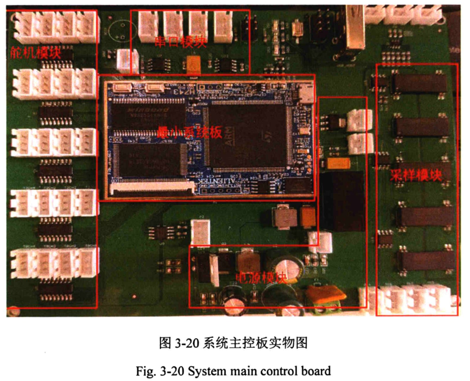

它们的吸附方式是钩爪爬壁吸附, 采用柔性钩爪, 钩住粗糙墙面的缝隙实现爬壁, 而且做了完整的实验测试, 但是需要指出的是这种吸附方法只适用于粗糙的墙壁, 对于我们管道爬壁来说参考价值不大

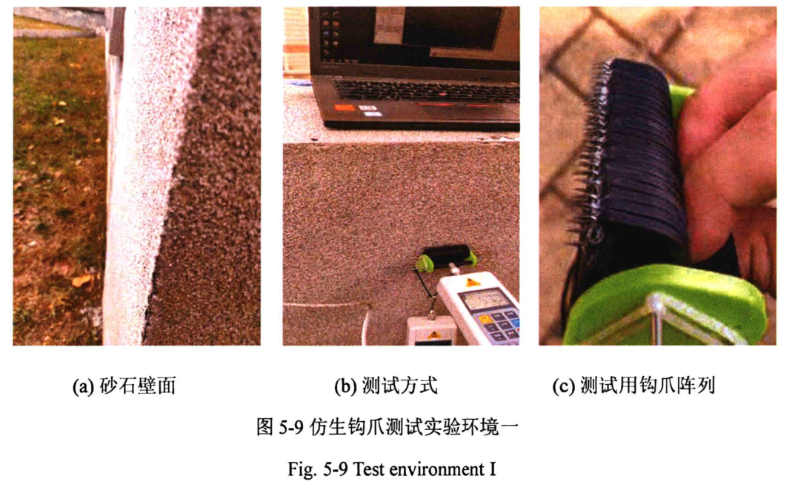
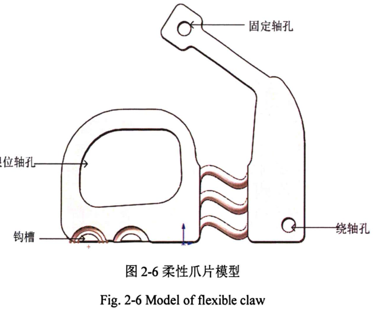

---

**附着特性爬壁机器人**

文章在这里

[基于仿生附着特性的爬壁机器人研究](./reference/基于仿生附着特性的爬壁机器人研究.pdf)

这篇文章做了两个机器人, 一个是仿壁虎, 一个是仿天牛, 它的吸附材料做的非常好, 吸附效果可以从它们的实物展示中看出来做的非常不错

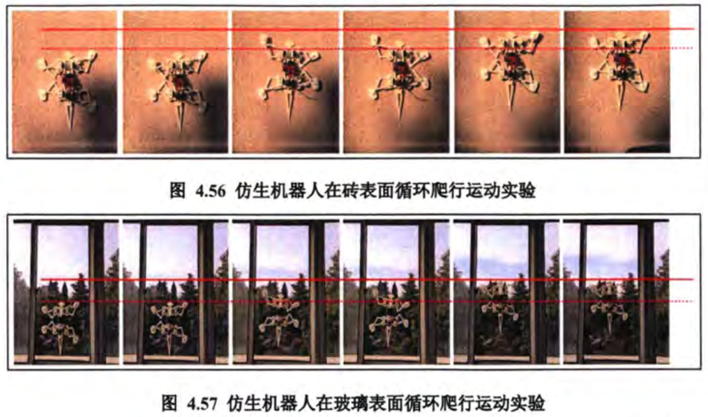

制备方法详细可以看文章, 需要刻蚀硅片的机器得到仿生刚毛阵列, 再用黏附材料涂抹得到仿生刚毛阵列

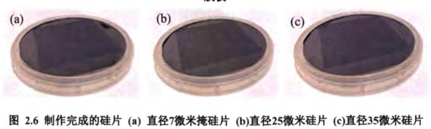
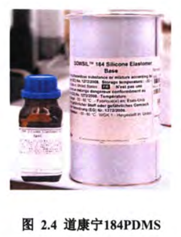

---

**壁虎仿生负压爬壁机器人**

文章在这里

[仿壁虎微黏附阵列负压流场数值模拟及试验研究](./reference/仿壁虎微黏附阵列负压流场数值模拟及试验研究.pdf)

这篇文章的吸附方法是负压吸附, 用真空泵制造负压55kPa配合吸盘吸附, 我觉得这对我们这些穷学生来讲算是比较现实的了: ) 

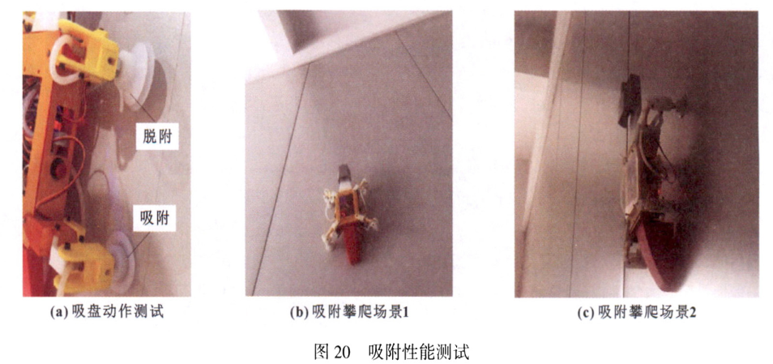

里面还有很多负压的计算, 还是有参考价值的

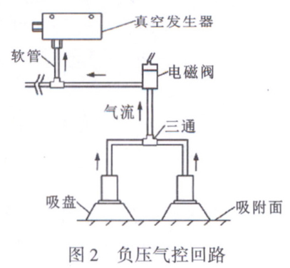
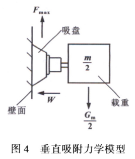

---

### 初步方案分析

**比较现实的负压吸附方案**

真空泵, 负压有50kPa, 可以PWM调节, 而且足够小

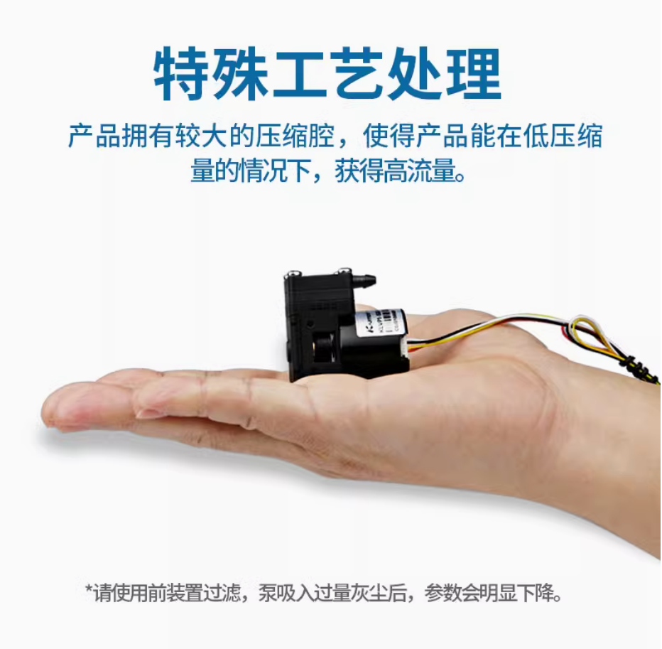
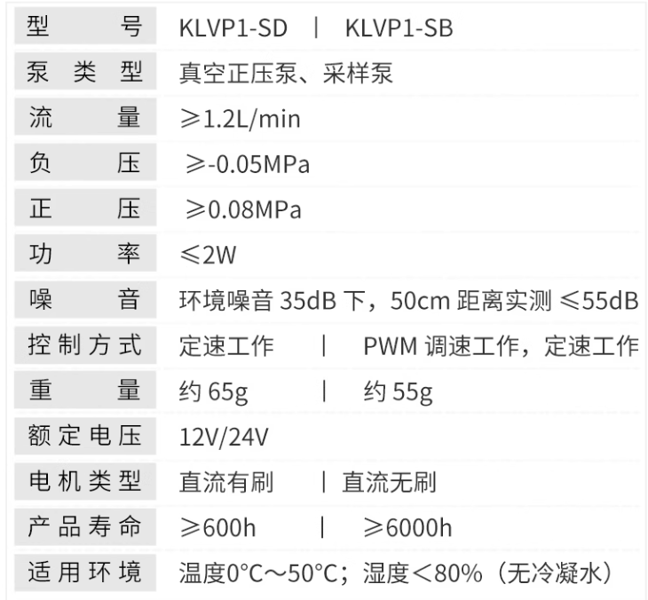

真空吸盘

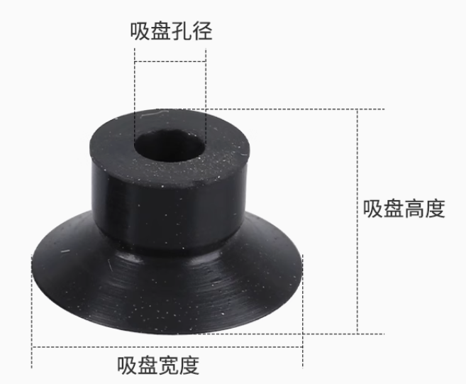

淘宝连接如下

[卡默尔小型真空泵气体隔膜泵气泵压缩机微型工业12v泵 klvp抽气泵-tmall.com天猫](https://detail.tmall.com/item.htm?detail_redpacket_pop=true&id=630725343940&ltk2=1746446848438t5ezbbt8a2qcd4d24g4l&ns=1&priceTId=2147840817464468381597557e1d59&query=真空泵&skuId=4481490048537&spm=a21n57.1.hoverItem.6&utparam={"aplus_abtest"%3A"f91935e4e3b87e4df2f391471b27499a"}&xxc=ad_ztc)

[SMC机械手真空吸盘工业气动元件硅橡胶吸嘴ZP2-B02MU/04/05/06-15-淘宝网](https://item.taobao.com/item.htm?id=599122278996&pisk=gyvEAAm7mvHFQSQdtd6zgqzW8v6dyTujzL_5q3xlAwbHOawyUN-mvwG-9URwrFCC-B_7UL7w-81BU3ePq3Y-vaiK1HKdeT0jlakXvHFsSlawU6bgsitgKa2o1OmE0orilxMXvXjdFh0XF87D2MSlEMfuE1mN0ialE_jHjcSlVyVuKUmZbgjUxJjlrOVGci6utWVhI1jPVy4utWVibgQGxgfHrhmN4NboHzLpyrsct0NHaJFSLlCNoHbaE-rAY6qp07w43lSd9ZfEu8e8wM5FoHbZup2LD1xRaLE8UwxHMUID-y0f93Aw7MWrCWXDbQYVXpDb8GdBjn_M0ueJv9R239AEW5BB8dXMKIruEhWFJ_J1_yuNopKMHOfsnm-MBetpQ3ZoEGTfSHphUxmAL9bhQGpSWJbysQvC9TUnl6Kk_FSFngWuyGVlBLdUr75hXG7jbc8rAkT2FOnKM7FRssjNlDCuw7Ch6G7jbcP8w1jcbZidZ&spm=pc_detail.29232929%2Fevo365560b447259.guessitem.d4)

---

**需要钞能力的仿生黏附方案**

可以去问问淘宝商家定制ICP刻蚀刚毛阵列硅片要多少钱, 注塑材料还算比较便宜

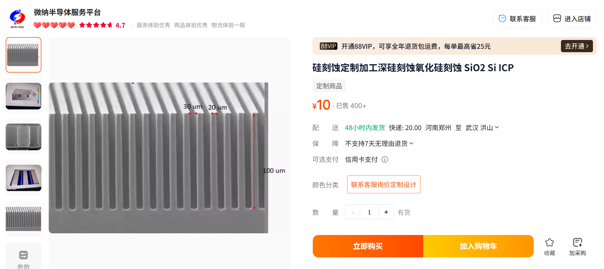

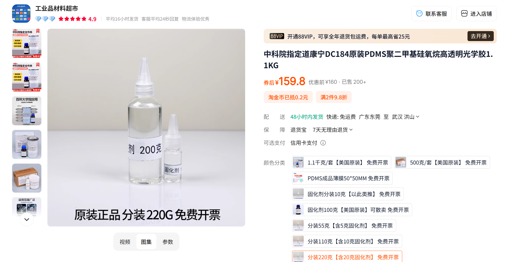

淘宝商家如下

[中科院指定道康宁DC184原装PDMS聚二甲基硅氧烷高透明光学胶1.1KG-淘宝网](https://item.taobao.com/item.htm?detail_redpacket_pop=true&id=779261268085&ltk2=174644832853112usjgz3mvagp2bblag1nq&ns=1&priceTId=2147820b17464483276346586e1690&query=道康宁184&skuId=5636783169201&spm=a21n57.1.hoverItem.1&utparam={"aplus_abtest"%3A"b916de8614ee1fce9531797e848685c8"}&xxc=ad_ztc)

[硅刻蚀定制加工深硅刻蚀氧化硅刻蚀 SiO2 Si ICP-淘宝网](https://item.taobao.com/item.htm?abbucket=1&detail_redpacket_pop=true&id=668016704761&ltk2=1746448357592ziwekohqux9wlykirlghc&ns=1&priceTId=2147820b17464483499637739e1690&query=ICP刻蚀&skuId=4983434402583&spm=a21n57.1.hoverItem.3&utparam={"aplus_abtest"%3A"a7eeca63c962938093ea1d0fc8bfac73"}&xxc=taobaoSearch)
