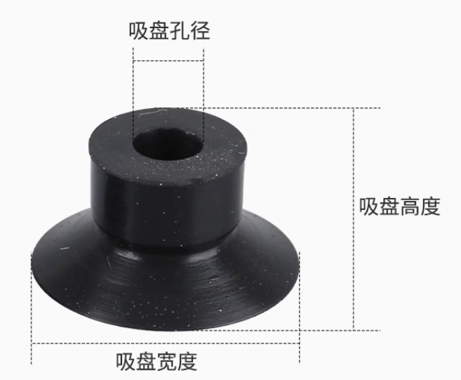
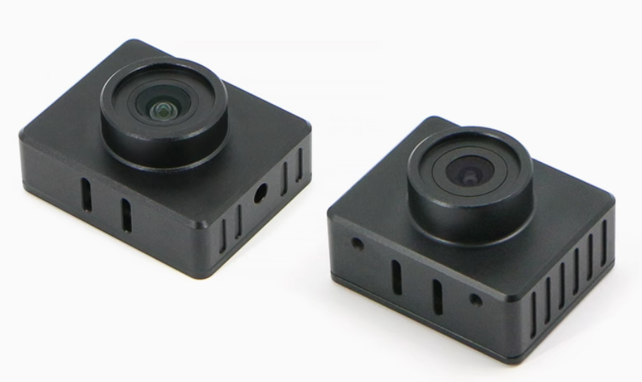

# 材料选型

### 动力系统

#### 吸附

**真空泵**, 负压有50kPa, 可以PWM调节, 而且足够小

[卡默尔小型真空泵气体隔膜泵气泵压缩机微型工业12v泵 klvp抽气泵-tmall.com天猫](https://detail.tmall.com/item.htm?detail_redpacket_pop=true&id=630725343940&ltk2=1746446848438t5ezbbt8a2qcd4d24g4l&ns=1&priceTId=2147840817464468381597557e1d59&query=真空泵&skuId=4481490048537&spm=a21n57.1.hoverItem.6&utparam={"aplus_abtest"%3A"f91935e4e3b87e4df2f391471b27499a"}&xxc=ad_ztc)

**真空吸盘**, 网上很多, 根据实际需要选

[SMC机械手真空吸盘工业气动元件硅橡胶吸嘴ZP2-B02MU/04/05/06-15-淘宝网](https://item.taobao.com/item.htm?id=599122278996&pisk=gyvEAAm7mvHFQSQdtd6zgqzW8v6dyTujzL_5q3xlAwbHOawyUN-mvwG-9URwrFCC-B_7UL7w-81BU3ePq3Y-vaiK1HKdeT0jlakXvHFsSlawU6bgsitgKa2o1OmE0orilxMXvXjdFh0XF87D2MSlEMfuE1mN0ialE_jHjcSlVyVuKUmZbgjUxJjlrOVGci6utWVhI1jPVy4utWVibgQGxgfHrhmN4NboHzLpyrsct0NHaJFSLlCNoHbaE-rAY6qp07w43lSd9ZfEu8e8wM5FoHbZup2LD1xRaLE8UwxHMUID-y0f93Aw7MWrCWXDbQYVXpDb8GdBjn_M0ueJv9R239AEW5BB8dXMKIruEhWFJ_J1_yuNopKMHOfsnm-MBetpQ3ZoEGTfSHphUxmAL9bhQGpSWJbysQvC9TUnl6Kk_FSFngWuyGVlBLdUr75hXG7jbc8rAkT2FOnKM7FRssjNlDCuw7Ch6G7jbcP8w1jcbZidZ&spm=pc_detail.29232929%2Fevo365560b447259.guessitem.d4)

**真空吸管**

[卡默尔PVC水管潜水泵管鱼缸养鱼丙酮吸管3毫米软管真空泵塑料管子-tmall.com天猫](https://detail.tmall.com/item.htm?abbucket=1&detail_redpacket_pop=true&id=573959086342&ltk2=1748695278676s7anx6rcuicukuio7h9vhh&ns=1&priceTId=214781cd17486952664308254e1ce9&query=真空吸管&skuId=3917371459573&spm=a21n57.1.hoverItem.6&utparam={"aplus_abtest"%3A"8a0db3aa7c3c951e5c796ca19e661aca"}&xxc=taobaoSearch)

#### 运动

**总线舵机**, 互联网开发板一般没有那么多PWM口控制多个舵机, 所以需要可以通过总线控制的舵机, 具体尺寸和力矩结构自己考虑

电压5-8V

[众灵串行总线舵机大扭力兼容PWM防堵转数字机器人机械臂双轴金属-淘宝网](https://item.taobao.com/item.htm?detail_redpacket_pop=true&id=549063298947&ltk2=1748696917419rkoli132sv7ry1zy0ooi6&ns=1&priceTId=2147819517486968343312651e1b5a&query=串口舵机&skuId=5275236974021&spm=a21n57.1.hoverItem.1&utparam={"aplus_abtest"%3A"3591a6473911df6b0883518105a4f932"}&xxc=ad_ztc)

**轮式电机**, 也需要可以总线控制, 因为没那么多GPIO, 其实RobotMaster的M2006就最好, 但是太贵了, 另一种方案就是买一个控制板来控制

[310直流减速电机 霍尔编码器高精度小车底盘微型马达电子竞赛电机-淘宝网](https://item.taobao.com/item.htm?id=726439497312&pisk=ggzqj_16tZQ2yIMxmzgwUlx-bS3x2VWCQPMss5ViGxD0cATa7YPhMxsODRrzI8njnoM67PkznFib75LZs52OMA1AVSFxWVXCdA7QMS3ZTxWauFmkq7hssIjSms-HOsWCdw_CmQ0N39w6nnR5rfHoifYim_-o_X3isj0GaYcZ9hv0IRfrqXhnsncMSUxoGYvmsfDiEacKgKYmmcfzZYhwoV0gI0fr6xsaHRpItmfTVBx6fU-xVvVmUFYe9joDxWK67FujimzBtYLiVzlq0vV0oYWAWb47zDiW1M3u9uwma27Wm2VzjJr3BMt-u5q0B0yAe3k7qrFiI0OMR7PUik0u51AK48cZxVmysFVrkYm_o2bHUbEuGl4Y3C8iMraIbvnPsFnsryi3x-RO970msRnL59Lxn5VLJkgFPn03al2UbgWXBbYCaPE2IhomwbkCa_7yMeyT54CAvhKtqDcrdsnMXhnm2bkCa_-9X0cnav1xj&spm=pc_detail.29232929%2Fevo365560b447259.guessitem.d2)

[四路编码电机驱动模块 板载稳压电路马达控制智能小车DIY电赛专用-淘宝网](https://item.taobao.com/item.htm?abbucket=1&detail_redpacket_pop=true&id=777535784787&ltk2=1748697594612heiccd4pr5jgdne116yiyi&ns=1&priceTId=2147819517486974978487676e1b5a&query=编码电机驱动模块&skuId=5313474380586&spm=a21n57.1.hoverItem.2&utparam={"aplus_abtest"%3A"b615578a31b28d460f518b836c731711"}&xxc=taobaoSearch)

	
    

	
    

#### 电控

**模型遥控**, 是带遥控数传的, SBUS协议是很常见的遥控协议

[亚博智能HOTRC HT-10A通道遥控器2.4G无线手柄航模小车ROS机器人-tmall.com天猫](https://detail.tmall.com/item.htm?abbucket=1&detail_redpacket_pop=true&id=675764345810&ltk2=1748696447624y5xm5hxsj0qjj6voto5rtk&ns=1&priceTId=214784f617486964373944860e145a&query=航模遥控&skuId=5676258803701&spm=a21n57.1.hoverItem.4&utparam={"aplus_abtest"%3A"201fe02165cc74c45fbc553011129af0"}&xxc=taobaoSearch)

	
    

**免驱usb摄像头**, 连互联网开发板

[RGB相机C100金属外壳USB免驱C70高清1080P摄像头Ubuntu系统RDK X5-tmall.com天猫](https://detail.tmall.com/item.htm?abbucket=1&detail_redpacket_pop=true&id=666156389569&ltk2=17486963060485z1nc2pd4jfbjsh5dtihuv&ns=1&priceTId=214784f617486961715035625e145a&query=usb摄像头&skuId=4937951485887&spm=a21n57.1.hoverItem.5&utparam={"aplus_abtest"%3A"2e94819f03f89ffaf7be85db49fd185f"}&xxc=taobaoSearch)

	
    

**互联网开发板**, 可以同时完成控制和图传, 龚灿你应该有这个板子

[OrangePi orange pi Zero3 zero 3 开发板 全志H618 香橙派-淘宝网](https://item.taobao.com/item.htm?abbucket=1&detail_redpacket_pop=true&id=742270145122&ltk2=174869609463297bgejf0hbbd1l0i1h079r&ns=1&priceTId=214784f617486958484853873e145a&query=香橙派&skuId=5294380324011&spm=a21n57.1.hoverItem.2&utparam={"aplus_abtest"%3A"aa31f3a84ea91fdb10fa6e3d5f765b9c"}&xxc=taobaoSearch)

	
    

**有关供电**, 这个机器人的供电系统会比较复杂, 接口上需要有usb供电, GPIO供电, 电压上从5V到12V都有, 所以估计要自己画供电板

**有关图传**, 互联网开发板做图传算是传统艺能了, 网上有各种教程, 这是我拿AI跑的 [orangepi_video_streaming_tutorial](./orangepi_video_streaming_tutorial.md)

